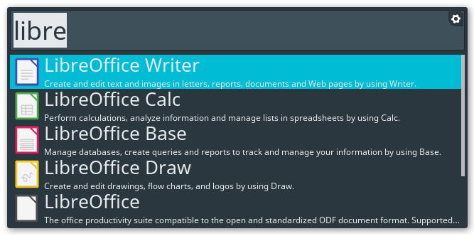

# adapta-theme-albert

Adapta theme for the albert launcher.

<https://github.com/adapta-project/adapta-gtk-theme>

<https://github.com/albertlauncher/albert>



Add `Adapta.qss` to:

`~/.local/share/albert/themes/`

or 

`/usr/share/local/albert/themes`

```
 __________________
< Have a nice day! >
 ------------------
        \   ^__^
         \  (oo)\_______
            (__)\       )\/\
                ||----w |
                ||     ||
```


